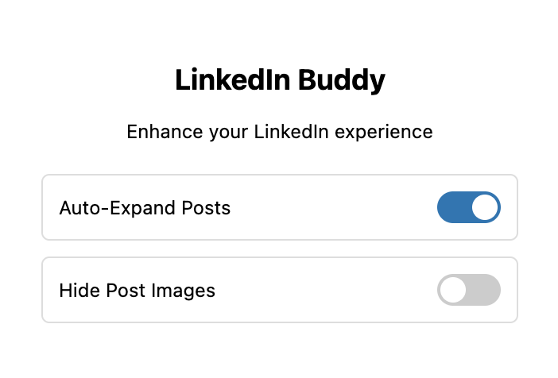

# LinkedIn Buddy

A browser extension that enhances your LinkedIn experience with feed improvements.

<p align="center">
  
</p>

## Features

- **Auto-Expand Posts**: Automatically expands truncated "see more" content in feed posts so you can read full posts without clicking
- **Hide Post Images**: Removes images and videos from feed posts for a text-focused reading experience

## Project Structure

```
linkedin-buddy/
├── extension/           # Browser extension files
│   ├── content.js      # Main content script
│   ├── popup.js        # Extension popup logic
│   ├── popup.html      # Extension popup interface
│   ├── styles.css      # Custom styles
│   ├── manifest.json   # Extension manifest
│   ├── icon16.png      # Toolbar icon
│   ├── icon48.png      # Extension management icon
│   └── icon128.png     # Chrome Web Store icon
└── README.md           # Project documentation
```

## Installation

1. Clone or download this repository
2. Open Chrome and go to `chrome://extensions/`
3. Enable "Developer mode" (toggle in top right)
4. Click "Load unpacked" and select the `extension` folder
5. Click the LinkedIn Buddy icon in your toolbar to toggle features

## Usage

1. Visit LinkedIn and click the LinkedIn Buddy extension icon
2. Toggle the features you want:
   - **Auto-Expand Posts** (on by default) - Shows full post content without needing to click "see more"
   - **Hide Post Images** - Strips images and videos from the feed for distraction-free reading
3. Settings are saved automatically

## Privacy

- All processing happens locally in your browser
- No data is sent to external servers
- Only runs on `linkedin.com`

## License

MIT
